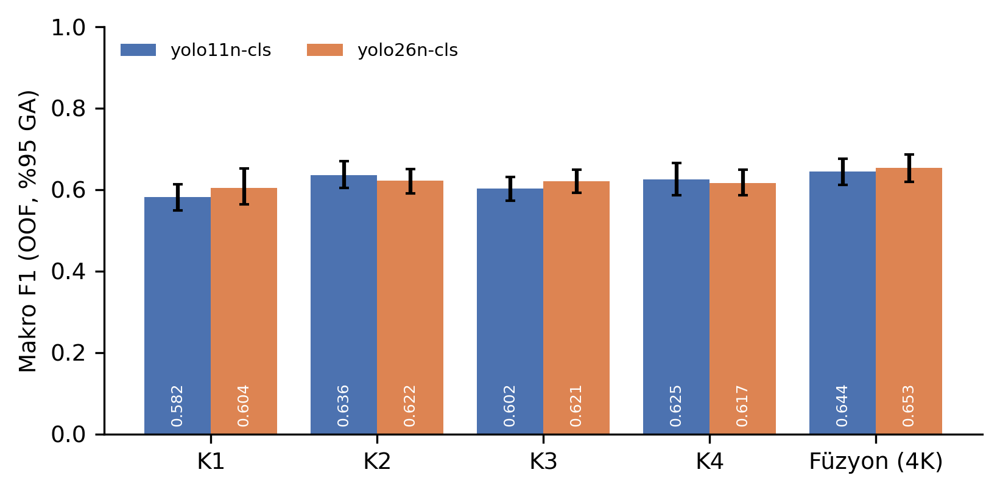

# Çok görünümlü domates görüntülerinde derin öğrenme tabanlı büyüme evresi sınıflandırması

Kamera görüşü, geç füzyon ve hesaplama maliyetinin, **TomatoMAP** veri seti üzerinde
bitki düzeyinde gruplanmış çapraz doğrulama ile incelendiği çalışmanın kodu, manifestleri
ve sonuç dosyaları.

> **İlgili çalışma:** Turan, G. (2026). *Çok görünümlü domates görüntülerinde derin öğrenme
> tabanlı büyüme evresi sınıflandırması: kamera görüşü, geç füzyon ve hesaplama maliyeti.*
> Yayımlanmamış çalışma.

---

## Kısaca ne yapıldı

| | |
|---|---|
| **Veri** | TomatoMAP (Zhang ve ark., 2026), 101 bitki, 1.343 bitki-gün oturumu, 4 sabit kamera × 12 poz |
| **Alt küme** | Oturum başına deterministik olarak seçilen tek poz × 4 kamera = **5.372 görüntü** |
| **Görev** | 50 BBCH kodundan indirgenmiş **6 ana büyüme evresi** sınıflandırması |
| **Modeller** | YOLO11n-cls ve YOLO26n-cls (sınıflandırma görevinde aynı mimari, farklı ön eğitimli ağırlıklar) |
| **Değerlendirme** | Bitki düzeyinde gruplanmış 5 katlı çapraz doğrulama, kat-dışı (OOF) tahminler |
| **Deney sayısı** | 2 ağırlık × 4 kamera × 5 kat = **40 eğitim** |
| **İstatistik** | Bitki kümeli eşleştirilmiş bootstrap (B = 2.000) + Holm düzeltmesi |

## Ana bulgular

- Dört kameranın **olasılık düzeyinde birleştirilmesi (geç füzyon)** en yüksek ham başarımı verdi:
  makro F1 **0,653**, doğruluk **0,835** (YOLO26n-cls).
- Füzyonun en iyi tek kameraya göre kazancı YOLO26n-cls için istatistiksel olarak desteklendi,
  YOLO11n-cls için desteklenmedi.
- Kamera çiftleri arasındaki farklar yalnızca YOLO11n-cls ağırlıklarında anlamlı çıktı;
  belirli bir kamera görüşünün genel üstünlüğü gösterilemedi.
- Füzyon, hesaplama yükünü ve toplam model boyutunu **dört katına** çıkarıyor
  (0,82 → 3,27 GFLOPs; A100 üzerinde 7,6 → 30,6 ms/oturum).
- Yalnızca 29 oturumla temsil edilen **yan sürgün oluşumu (S2)** evresi hiçbir koşulda öğrenilemedi.



## Depo yapısı

```
src/tomato_pipeline.py        Sekiz aşamalı pipeline (indeks → poz seçimi → görüntüler →
                              katlar → eğitim/test → OOF + füzyon → maliyet → analiz)
notebooks/                    Colab sürücü defteri (denetim hücreleriyle)
manifests/                    Poz seçim manifesti, bitki düzeyinde kat manifesti, alt küme listesi
results/tables/               Makaledeki bütün tablolar (CSV + ALL_TABLES.xlsx)
results/figures/              Makale ve ek dosyadaki şekiller (PNG 300 dpi + PDF)
results/oof/                  Kamera başına kat-dışı tahminler ve füzyon çıktıları (olasılıklar dahil)
results/SUMMARY_FOR_MANUSCRIPT.json   Bütün sayısal sonuçların tek dosyada özeti
training_curves/              40 eğitim koşusunun epok bazında kayıtları
logs/                         Çalıştırma günlüğü, yapılandırma ve ortam bilgisi
docs/                         Çalışmanın tasarım dokümanı
```

## Yeniden üretme

1. Colab'da GPU çalışma zamanı açın ve `notebooks/YOLODomatesEylul2026.ipynb` defterini yükleyin.
2. `src/tomato_pipeline.py` dosyasını Drive'daki `YOLODomatesEylul2026/code/` klasörüne koyun.
3. Hücreleri sırayla çalıştırın. Aşamalar kaldığı yerden devam eder; tamamlanan işler atlanır.

Veri, Hugging Face'teki `Voxel51/tomato-map` aynasından indirilir (yalnızca seçilen ~5.400 dosya).
İndirme hız sınırlarına takılmamak için Colab Secrets içine `HF_TOKEN` eklemeniz önerilir.

Analiz aşaması GPU gerektirmez: `results/oof/` altındaki tahmin dosyaları depoda olduğu için
bütün tablolar ve şekiller eğitim yapılmadan yeniden üretilebilir.

## Tasarım kararları

- **Bitki düzeyinde bölme.** Aynı bitkinin oturumları bağımsız gözlem değildir; bir bitkinin
  bütün görüntüleri tek bir kata atanır. Kat manifesti bir kez üretilir ve bütün kamera/modellerde
  aynen kullanılır, böylece kameralar birebir aynı bitkiler üzerinde karşılaştırılır.
- **Deterministik poz seçimi.** Poz, `sha256(tohum:oturum)` üzerinden seçilir; seçim oturumlar
  arası bağımsızdır ve manifeste kaydedilir.
- **Eşleştirilmiş istatistik.** Aynı bootstrap örneklemi bütün sistemlere uygulanır; çoklu
  karşılaştırma düzeltmesi üç aile içinde ayrı ayrı Holm yöntemiyle yapılır.
- **Kamera adlandırması.** Kaynak kamera modüllerini 45°, 90°, 135° ve 180° düşey eğim açılarıyla
  tanımlar; veri dosyalarındaki kamera kimlikleriyle bu açıların eşleşmesi doğrulanamadığı için
  kameralar K1–K4 olarak anılır ve sonuçlar açı değerleriyle ilişkilendirilmez.

## Veri ve lisans

- **Veri seti:** TomatoMAP, CC BY 4.0. Zhang, Y., Struckmeyer, S., Kolb, A., Reichardt, S. (2026).
  *Tomato multi-angle multi-pose dataset for fine-grained phenotyping.* Scientific Data, 13: Makale 309.
  https://doi.org/10.1038/s41597-026-06926-9
- **Bu depodaki kod:** MIT Lisansı (bkz. `LICENSE`).
- **Uyarı:** Ultralytics kütüphanesi AGPL-3.0 ile dağıtılmaktadır; bu depodaki kodun ticari
  kullanımında Ultralytics lisans koşulları ayrıca değerlendirilmelidir.

## Atıf

Bu depoya atıf yapmak için:

```bibtex
@misc{turan2026multiviewbbch,
  author = {Turan, Gökhan},
  title  = {Çok görünümlü domates görüntülerinde derin öğrenme tabanlı büyüme evresi
            sınıflandırması: kamera görüşü, geç füzyon ve hesaplama maliyeti},
  year   = {2026},
  note   = {Kod ve sonuç deposu},
  url    = {https://github.com/gokhanturan/tomato-multiview-bbch}
}
```
